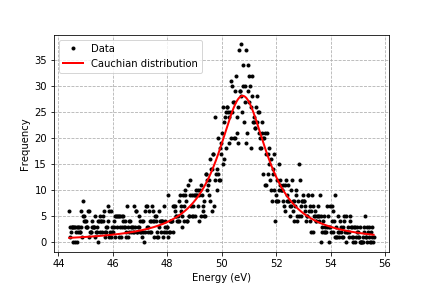
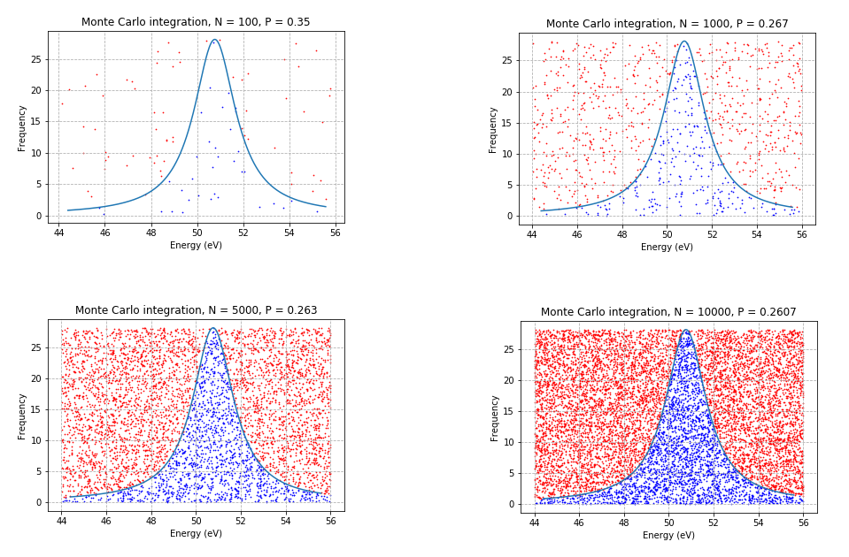

# Python 3 for scientific computing project
Author: Niko Gullsten

## Background

Project was inspired more or less directly from another course (FYS-1326 Methods in Physics) where we had to measure and analyze the Compton effect. It was measured in TUT and analyzed with Python 3 using the Monte Carlo integration method.

### Plotting the data

We basically plot the data points and the cauchian distribution for the data as shown.

### Monte Carlo integration

Monte Carlo integration is a numerical integration technique. While other algorithms usually evaluate the integrand at a regular grid, Monte Carlo randomly choose points at which the integrand is evaluated. This method is particularly useful for higher-dimensional integrals.

In layman's terms it "shoots a dart" at the plot. It then counts all the hits and misses (hit means the dart can be found inside the area of the function, miss means the opposite).

These pictures show the number of times we "shoot a dart", N, and the corresponding probability P (hits divided by throws).

